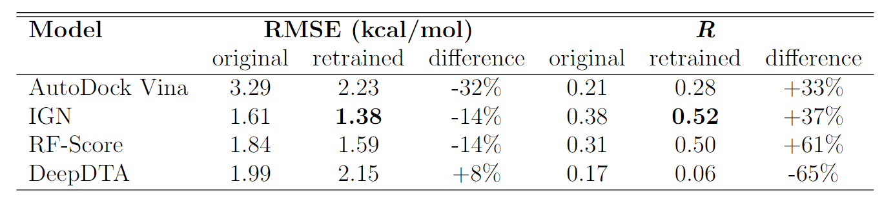
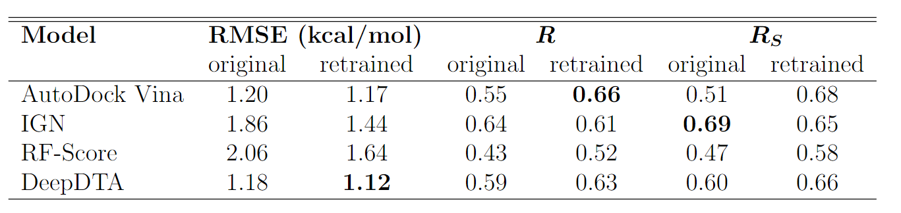
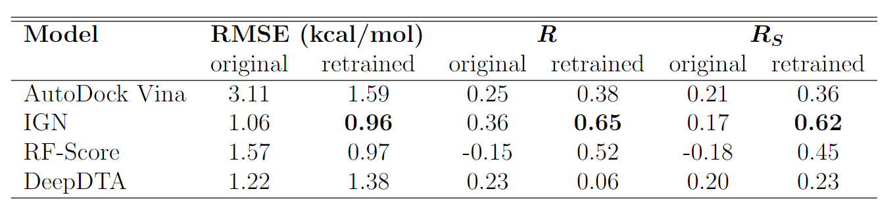

# LP-PDBBind: Developing More Generalizable Scoring Functions with Better Utilization of the PDBBind Dataset
This repository contains all the code for creating LP-PDBBind of PDBBind dataset, building the BDB2020+ dataset, prepared dataset files, and scripts for retraining AutoDock vina, IGN, RFScore and DeepDTA models

## Authors
* Jie Li `jerry-li1996@berkeley.edu`
* Xingyi Guan `nancy_guan@berkeley.edu`
* Oufan Zhang `oz57@berkeley.edu`
* Kunyang Sun `kysun@berkeley.edu`
* Yingze Wang `ericwangyz@berkeley.edu`
* Dorian Bagni `dorianbagni@berkeley.edu`
* Teresa Head-Gordon `thg@berkeley.edu`

## Results summary
### BDB2020+ benchmark

### mPro benchmark

### EGFR benchmark


## Compiled datasets
### LP-PDBBind
The LeakProof of PDBBind 2020 (LP-PDBBind) is given in `dataset/LP_PDBBind.csv`. The `new_split` column corresponds to which category the data belongs to in LP-PDBBind. Additionally, `CL1`, `CL2`, `CL3` and `covalent` are boolean columns indicating whether the data is in the corresponding clean levels, and whether the data is covalent or not. Therefore, the following python code reads in the dataset and selects all data in the train set, and satisfy CL1 and non-covalent:

```python
import pandas as pd
df = pd.read_csv('dataset/LP_PDBBind.csv', index_col=0)
df_train = df[(df['new_split'] == 'train') & df.CL1 & ~df.covalent]
```
Only the meta-information (including pdbid, category, clean levels, whether is covalent, ligand SMILES strings, protein sequence, binding affinity values, etc.) are present in the csv file. Users need to download the prepared structure files (.pdb format for the proteins and .sdf/.mol2 format for the ligands) from the [PDBBind website](http://www.pdbbind.org.cn/download.php).

### BDB2020+
The compressed BDB2020+ dataset (`dataset/BDB2020+.tgz`) can be decompressed by:
```
tar -xzf dataset/BDB2020+.tgz
```

which will create the `BDB2020+` folder. Inside the folder there will be `BDB2020+.csv` and the `dataset` folder. The `BDB2020+.csv` contains the meta-information of the dataset, and the `dataset` folder contains the prepared structure files for each protein-ligand complex.

### SARS-COV-2 main protease dataset
The compressed SARS-COV-2 main protease dataset (`dataset/mpro.tgz`) can be decompressed by:
```
tar -xzf dataset/mpro.tgz
```

which will create the `mpro` folder. Inside the folder there will be `info.csv` and multiple folders named by the pdbids. The `info.csv` contains the meta-information of the dataset, and the other folders contain the prepared structure files for the protein-ligand complexes.

### EGFR
The compressed EGFR dataset (`dataset/EGFR.tgz`) can be decompressed by:
```
tar -xzf dataset/EGFR.tgz
```

which will create the `EGFR` folder. Inside the folder there will be `info.csv` and three folders `protein`, `ligand` and `ligand_addH`. The `info.csv` contains the meta-information of the dataset, and the other folders contain the prepared structure files for the protein-ligand complexes.

## Dataset creation scripts
Inside the `dataset_creation` folder there are multiple jupyter notebooks for the creation of LP-PDBBind and BDB2020+ dataset.

### Required packages
* pandas
* rdkit 
* biopython

### Notebook descriptions
* `prepare_info.ipynb`: Preparing the basic PDBBind dataset information. It downloads the PDBBind PDB files directly from RCSB to retain the header information, and extracts category, release year and resolution from the PDB files. Additionally, it extracts the SMILES strings for the ligands and the sequence of the proteins from the PDB files.

* `calc_similarities.ipynb`: Extracting protein types from the categories, calculate pairwise ligand fingerprint similarities and pairwise protein sequence similarities.

* `create_splitting.ipynb`: Creating the LP-PDBBind splitting of PDBBind dataset based on protein and sequence similarity.

* `CL_filters`: Scripts for defining the three clean levels (CL1-CL3), and finding out covalent binders in PDBBind.

* `prepare_BDB2020+_dataset.ipynb`: Script for cleaning up the raw matched data in BindingDB and prepare the BDB2020+ dataset.

## Model retraining
Please refer to the `model_retraining` folder for the scripts for retraining and retrained model weights for AutoDock vina, IGN, RFScore and DeepDTA.
